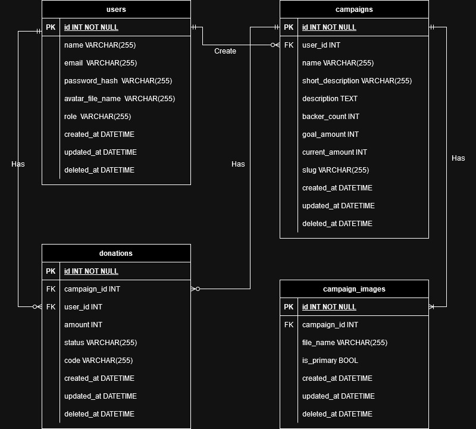

# Crowdfunding App (Galang Dana)

## About Project

Aplikasi ini secara garis besar adalah website penggalangan dana yang bertujuan untuk memudahkan user jika ingin turut serta dalam suatu kegiatan sosial yang di adakan. Sehingga user tidak perlu untuk melakukan donasi secara manual melalui trasfer namun bisa dengan secara langsung melalui payment gateway yang tersedia. Selain itu, user juga bisa mengecek progres penggalangan dana secara real time. API ini menyediakan antarmuka untuk mengelola penggalangan dana, user, dan donasi. Juga merupakan sistem yang dirancang untuk mendukung platform penggalangan dana online. Ide project ini berawal dari perbincangan sederhana untuk membantu sebuah teman di komunitasnya, guna menyediakan media penggalangan dana yang memudahkan para pengguna, dan agar tidak lagi harus melakukannya secara manual.

## Features

Fitur utama di aplikasi ini srupda dengan flow intinya, yaitu user masuk dan melakukan registrasi hingga tuntas.

### User

- Register
- Login
- Create Donations
- Give Donations
- Payment with Midtrans
- Check Donation Goal

### Admin

- Manage User
- Manage Donations
- Manage Payment

## Tech Stacks

**Bahas Pemograman:**

- Golang

**Database:**

- MySQL

**ORM:**

- Gin

**Library:**

- Cloudinary -> github.com/cloudinary/cloudinary-go
- JWT -> github.com/dgrijalva/jwt-go
- Gin -> github.com/gin-gonic/gin
- Validator -> github.com/go-playground/validator/v10
- Slug -> github.com/gosimple/slug
- Accounting -> github.com/leekchan/accounting
- Testify -> github.com/stretchr/testify
- Midtrans -> github.com/veritrans/go-midtrans
- Gorm -> gorm.io/gorm

**Service:**

- Midtrans
- Cloudinary
- Google Cloud Platform
- Git
- Github

**Tools:**

- Visual Studio Code
- Postman

## API Documentation

```
https://winter-astronaut-378621.postman.co/workspace/Adosistering~8afaf234-12a3-4403-b27d-e5a8864c4092/collection/24029040-0b8e2295-acf9-4243-9b90-5fc05b81e389?action=share&creator=24029040
```

## ERD



## Setup

**Clone Project from Github**

```bash
git clone https://github.com/FaqihAzh/crowdfunding-minpro-alterra.git
```

**Go to Project**

```bash
cd crowdfunding-minpro-alterra
```

**Install Depedency**
Jika proyek menggunakan dependensi pihak ketiga, jalankan perintah berikut:

```bash
go mod tidy
```

**Config**
Set .env file

```bash
 DBPass = ""
 DBHost = ""
 DBPort = ""
 JWT_SECRET= ""
 MIDTRANS_SERVER_KEY=""
 MIDTRANS_CLIENT_KEY=""
 CLOUDINARY_URL=""
```

**Menjalankan Aplikasi**
Untuk menjalankan aplikasi, jalankan:

```bash
go run main.go
```
